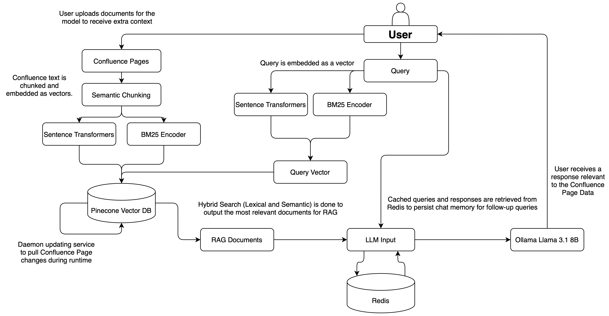
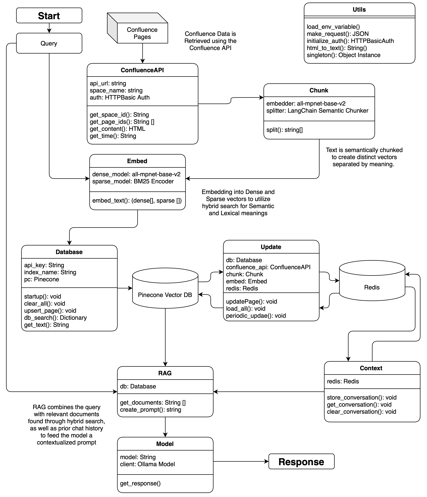

# Confluence-Enhanced LLM Retrieval

## Overview

This project is designed as a productivity tool that integrates a company's Confluence Pages to enhance the contextualization of responses generated by Language Models (LLMs). By leveraging a Retrieval-Augmented Generation (RAG) system and a locally hosted `Llama 3.1 8B` model via `Ollama`, the system performs hybrid searches (both semantic and lexical) to retrieve pertinent documents, which are then incorporated into the model's generation process. The result is a highly relevant and contextually aware response, tailored to the user's query.

### Key Features

- **Retrieval-Augmented Generation (RAG)**: Enhances the relevance and quality of responses by integrating retrieved documents into the text generation process.
- **Llama 3.1 Optimization**: Utilizes the latest `Llama 3.1` model to ensure state-of-the-art text generation.
- **Hybrid Search Mechanism**: Combines lexical search using sparse vector embeddings and semantic search with dense vector embeddings powered by the `all-mpnet-base-v2` model.
- **Seamless Confluence Integration**: Leverages the Confluence API to retrieve documents, enriching the model's knowledge base.
- **Efficient Query Processing**: Implements a singleton pattern to avoid redundant re-embedding, minimizing latency and accelerating response times.
- **Real-Time Document Updates**: Supports a daemon function that automatically synchronizes the search index with any modifications made to Confluence documents, ensuring up-to-date retrieval.

## Project Structure
```
enhanced-llm-retrieval/
├── hybrid_search/
│   ├── __init__.py
│   ├── chunk.py
│   ├── confluence.py
│   ├── database.py
│   ├── embed.py
│   ├── search.py
│   ├── update.py
│   └── utils.py
├── rag_llm/
│   ├── __init__.py
│   ├── context.py
│   ├── model.py
│   ├── rag.py
│   └── response.py
├── main.py
├── .gitignore
├── License
├── README.md
└── requirements.txt
```

## Architecture

### High-Level Overview


### Low-Level Overview


## Prerequisites

Before installing and running the project, ensure you have the following:

- Python 3.8 or later
- Required Python packages (refer to `requirements.txt`)
- Pinecone DB instance with an API key
- Confluence Space and API Key
- Ollama Client

## Getting Started

### Installation

1. **Clone the Repository**  
   Start by cloning the repository to your local machine:

   ```bash
   git clone https://github.com/adityaramesh15/enhanced-llm-retrieval
   ```

2. **Configuration**  
   Set up the necessary environment variables and configurations, including API keys for Pinecone and Confluence.

### Running the Application

1. **Start Redis**  
   Start the Redis server to handle message streaming for conversations.

   ```bash
   redis-server
   ```

2. **Start Ollama**  
   Initialize the Ollama client to host the Llama 3.1 model locally.

   ```bash
   ollama start
   ```

3. **Run `main.py`**  
   Launch the main application script.

   ```bash
   python3 main.py
   ```

## Troubleshooting

If you encounter any issues, please check the following:

- Ensure all dependencies are properly installed.
- Verify API keys and configurations for external services.
- Check if the Redis server and Ollama client are running correctly.

## Limitations

- **Scalability**: The current implementation is optimized for small to medium-sized datasets. Performance may degrade with very large Confluence Spaces or extensive document collections.
- **Dependency on Confluence API**: The integration heavily relies on the Confluence API. Any changes to the API or service downtime could impact functionality.
- **Local Model Hosting**: Hosting the Llama 3.1 model locally may require significant computational resources, depending on the usage scale.

## Future Plans
- **Scalability Improvements**: Enhance the system architecture to support larger datasets and improve response times for extensive document collections.
- **Enhanced Search Features**: Integrate additional search capabilities, such as advanced filtering and result ranking, to improve the precision of document retrieval.
- **User Interface**: Develop a user-friendly front-end interface for better accessibility and usability of the system.
- **Cloud Hosting**: Explore cloud-based hosting options for the Llama 3.1 model to reduce local resource dependency and increase scalability.

## Contribution Guidelines

Contributions are welcome! To contribute:

1. **Fork the Repository**: Fork the repository on GitHub.
2. **Create a New Branch**: Create a branch for your feature or bug fix.
3. **Implement Changes**: Make your changes with clear, descriptive commit messages.
4. **Submit a Pull Request**: Submit a pull request with a detailed description of your changes.

Please ensure your code follows the project's coding standards and includes appropriate tests. For significant changes, consider opening an issue first to discuss your proposal.

## License

This project is licensed under the MIT License. See the [LICENSE](LICENSE) file for details.